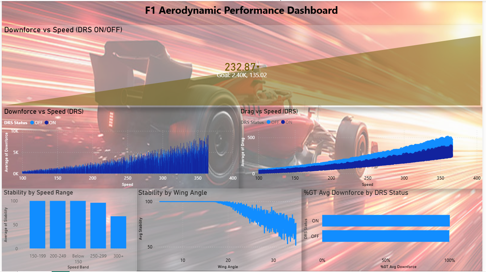
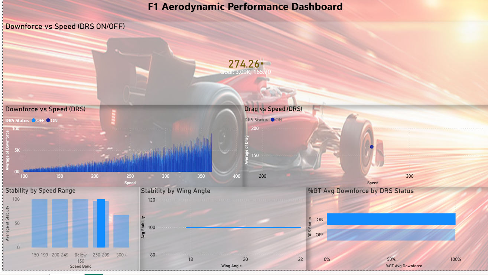
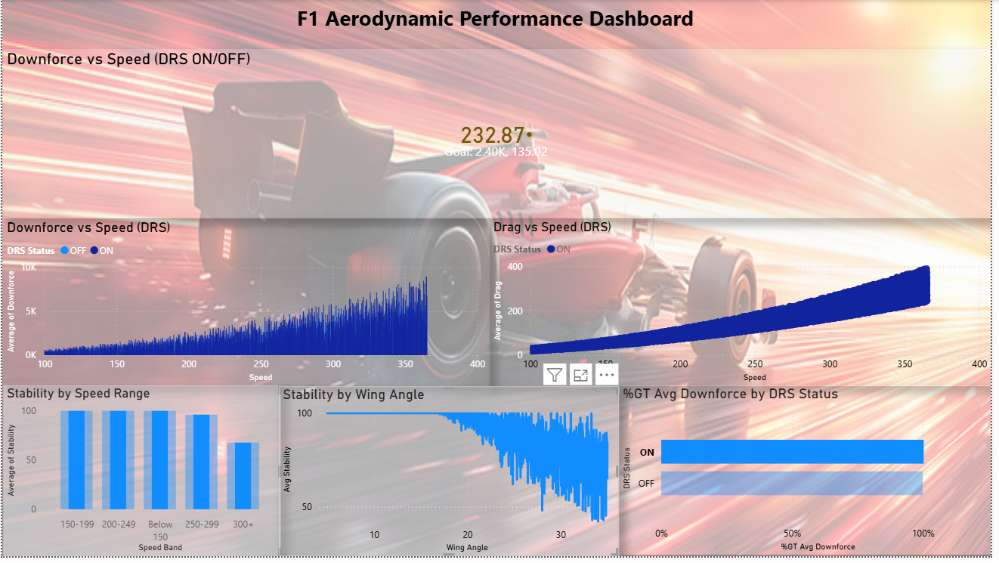

# 🏎️ F1 Performance Analytics Dashboard | Power BI

## 👩‍💻 About Me

Hi, I'm **Moulya Eraiahswamy**, a Data Analyst passionate about transforming raw data into meaningful insights.
Currently pursuing a Master’s in Data Analysis in France and actively seeking Data Analyst opportunities.

---

## 📊 Project Overview

This project presents an **interactive Power BI dashboard** built using Formula 1 telemetry data to analyze driver performance, lap efficiency, and race trends.

The objective is to simulate a real-world analytics scenario where data is transformed into **actionable insights for performance optimization and decision-making**.

---

## 🎯 Business Objective

* Analyze driver and vehicle performance
* Identify patterns in lap times and speed
* Enable data-driven insights for competitive advantage

---

## 🛠️ Tech Stack

* **Power BI** → Dashboard development & visualization
* **Power Query** → Data cleaning & transformation
* **DAX** → KPI calculations & measures
* **Excel / CSV** → Data source

---

## 💡 Key Skills Demonstrated

* Data Cleaning & Transformation
* Data Modeling (Star Schema Basics)
* KPI Design & Performance Tracking
* Data Visualization & Storytelling
* Analytical Thinking & Insight Generation

---

## 📈 Dashboard Highlights

* 📌 Driver performance comparison
* 📌 Lap time trend analysis
* 📌 Speed and telemetry insights
* 📌 Interactive slicers for dynamic filtering
* 📌 KPI-focused dashboard layout

---

## 📷 Dashboard Preview

---

## 📁 Project Structure

* `f1-dashboard-template.pbit` → Power BI Template
* `actaruslab_f1_telemetry_2026.csv` → Dataset
* `dashboard_screenshots/` → Dashboard visuals

---

## 🚀 Key Insights

* Identified performance variations across drivers
* Highlighted lap time inconsistencies
* Enabled quick comparison using interactive filters
* Improved understanding of race performance trends

---

## 📊 Why This Project Matters

This project demonstrates the ability to:

* Work with real-world structured data
* Build end-to-end dashboards
* Translate data into business insights

---

## 🔗 Let’s Connect

* 💼 LinkedIn: https://linkedin.com/in/moulya-eraiahswamy
* 💻 GitHub: https://github.com/Moulyaamrutha

---

⭐ If you like this project, feel free to star the repository!
